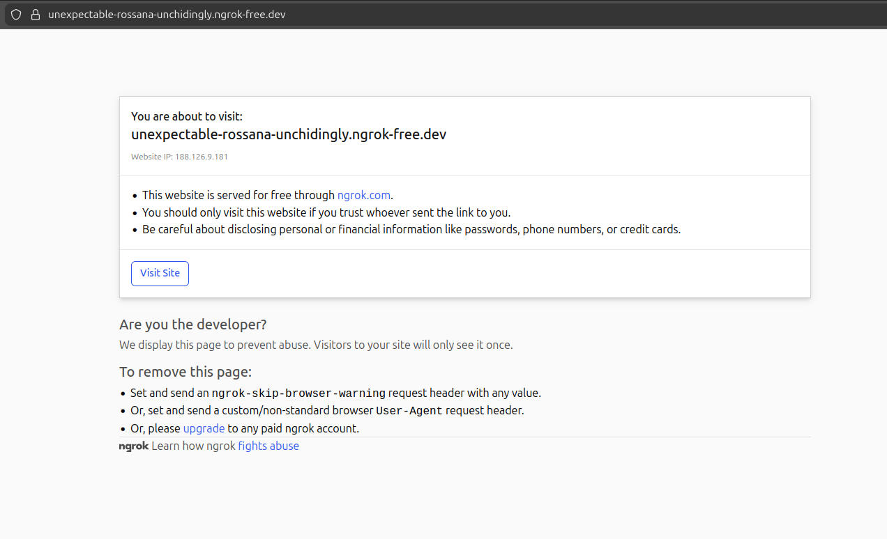

### Шаг 1. Устанавливаем `ngrok`

1. Регистрируемся: [https://ngrok.com/](https://ngrok.com/)

2. Входим и попадаем в Dashboard. Выбираем OC и способ установки.

Например, для Linux:

```bash
curl -sSL https://ngrok-agent.s3.amazonaws.com/ngrok.asc \
  | sudo tee /etc/apt/trusted.gpg.d/ngrok.asc >/dev/null \
  && echo "deb https://ngrok-agent.s3.amazonaws.com bookworm main" \
  | sudo tee /etc/apt/sources.list.d/ngrok.list \
  && sudo apt update \
  && sudo apt install ngrok
```

**Проверяем установку**:

```bash
ngrok version
```

**Должно быть что-то вроде этого**:

```
ngrok version 3.36.1
```

3. На той же странице ниже копируем скрипт для настройки файла-конфигурации на вашей машине:

```bash
ngrok config add-authtoken 3asdf5egdrs4tsatsafnafh4rtadfh4art4rtr4tsrtdtart78srt
```

**Должно быть что-то вроде этого**:


```
Authtoken saved to configuration file: /home/su/.config/ngrok/ngrok.yml
```

4. Получаем виртуальный https домен grok:

```bash
ngrok http 8000
```

**С небольшой задержка должно быть что-то вроде этого**:

```
grok                                                                                                                                        (Ctrl+C to quit)
                                                                                                                                                             
🚪 One gateway for every AI model. Available in early access *now*: https://ngrok.com/r/ai                                                                   
                                                                                                                                                             
Session Status                online                                                                                                                         
Account                       ibarbylev@gmail.com (Plan: Free)                                                                                               
Version                       3.36.1                                                                                                                         
Region                        Europe (eu)                                                                                                                    
Latency                       58ms                                                                                                                           
Web Interface                 http://127.0.0.1:4040                                                                                                          
Forwarding                    https://unexpectable-rossana-unchidingly.ngrok-free.dev -> http://localhost:8000                                               
                                                                                                                                                             
Connections                   ttl     opn     rt1     rt5     p50     p90                                                                                    
                              0       0       0.00    0.00    0.00    0.00                                                                                   
```


Таким образом, любой внешний запрос на ` https://unexpectable-rossana-unchidingly.ngrok-free.dev`  

будет тут же перенаправлен на `http://localhost:8000`


---

### Шаг 2. Устанавливаем `FastAPI`

```bash
pip install fastapi[standard] ngrok

pip freeze > requirements.txt
```

---

### Шаг 3. Создаём минимальный сервер FastAPI

`main.py`:

```python
from fastapi import FastAPI, Request

app = FastAPI()


@app.get("/")
async def root():
    return {"status": "server works"}


@app.post("/test")
async def test(request: Request):
    data = await request.json()
    print("Получены данные:", data)
    return {"received": data}
```

---

### Шаг 4. Запуск FastAPI

В терминале:

```bash
uvicorn main:app --reload
```

Проверяем в браузере:

```
http://127.0.0.1:8000
```

Ответ:

```json
{"status":"server works"}
```

---

### Шаг 5. Проверка доступа "извне"

Откройте в браузере:

```
https://unexpectable-rossana-unchidingly.ngrok-free.dev
```

Первый раз на бесплатном тарифе браузер должен показать эту страницу:



Просто жмём кнопку `Visit site`!

Это создать cookies в браузере, и пока они там есть, эта страница показываться не будет.  
А в браузере вы должны получить:

```json
{"status":"server works"}
```

Если это работает — значит:

* ваш **локальный FastAPI сервер доступен из интернета**
* есть **HTTPS адрес**
* Telegram сможет к нему подключиться

---

### Шаг 6. Проверка POST запроса

Теперь проверим endpoint `/test` командой `curl` из терминала:

```bash
curl -X POST https://unexpectable-rossana-unchidingly.ngrok-free.dev/test \
-H "Content-Type: application/json" \
-d '{"message":"hello"}'
```

Ответ:

```json
{"received":{"message":"hello"}}
```

А в терминале FastAPI появится:

```
Получены данные: {'message': 'hello'}
```

---

То есть, фактически, мы сейчас фактически выполнили

```
Интернет
    │
    │ HTTPS
    ▼
ngrok туннель
    │
    ▼
localhost:8000
    │
    ▼
FastAPI
```

### Шаг 6. Добавляем в `local_settings.py`

```python
NGROK_DOMAIN_NAME = 'https://unexpectable-rossana-unchidingly.ngrok-free.dev'
```

---

### Шаг 7. Подключим Telegram к нашему FastAPI через webhook

Сейчас мы построим следующую схему:

```
Пользователь
     │
     ▼
 Telegram
     │  POST update
     ▼
https://xxxxx.ngrok-free.app/webhook
     │
     ▼
FastAPI
     │
     ▼
наш код бота
     │
     ▼
Telegram API → ответ пользователю
```

---

### Шаг 8. Создаём webhook endpoint

Добавляем новый эндпойнт в `main.py`.

```python
# --- Добавляем эндпойнт webhook и пару импортов ---------------------------------

import httpx
from local_settings import TG_TOKEN

TG_API = f"https://api.telegram.org/bot{TG_TOKEN}"


@app.post("/webhook")
async def telegram_webhook(request: Request):

    data = await request.json()

    print("Update:", data)

    # проверяем есть ли сообщение
    if "message" in data:
        chat_id = data["message"]["chat"]["id"]
        text = data["message"].get("text", "")

        response_text = f"Вы сказали: {text}"

        httpx.post(
            f"{TG_API}/sendMessage",
            json={
                "chat_id": chat_id,
                "text": response_text
            }
        )

    return {"ok": True}

```

Этот код:

* принимает **update от Telegram**
* извлекает `chat_id`
* отправляет ответ через `sendMessage`


### Шаг 9. Проверим, как работает этот эндпойнт

Чтобы не мучиться с подстановкой в curl трёх констант, создадим отдельный проверочный скрипт:

`checking_webhook_endpoint.py`

```python
import httpx
from local_settings import TG_TOKEN

BASE_URL = f"https://api.telegram.org/bot{TG_TOKEN}"

def get_chat_id():
    url = f"{BASE_URL}/getUpdates"
    try:
        response = httpx.get(url, timeout=5.0)
        data = response.json()
        if not data.get("ok"):
            print("Ошибка Telegram:", data)
            return None

        results = data.get("result", [])
        if not results:
            print("Нет новых обновлений. Напишите боту хотя бы одно сообщение.")
            return None

        # Берём chat_id из первого обновления
        message = results[0].get("message")
        if message and "chat" in message:
            chat_id = message["chat"]["id"]
            print(f"Найден chat_id: {chat_id}")
            return chat_id
        else:
            print("В обновлениях нет поля chat")
            return None

    except Exception as e:
        print("Ошибка сети:", e)
        return None

if __name__ == "__main__":
    
    # --- сначала получаем id чата, которое нужно в запросе к эндпойнту -------------
    chat_id = get_chat_id()

    # --- а вот теперь проверяем сам эндпойнт ----------------------------------------
    data = {
        "update_id": 123456,
        "message": {
            "message_id": 1,
            "chat": {"id": chat_id, "type": "private"},
            "text": "Привет, проверка webhook!"
        }
    }

    resp = httpx.post("http://localhost:8000/webhook", json=data)
    print(resp.json())
```

Должно появиться что-то вроде этого:

```
Найден chat_id: 1960023757
{'ok': True}
```


---

### Шаг 10. Регистрируем webhook в Telegram

Теперь нужно сказать Telegram:

> отправляй все события на наш сервер

Для этого создадим и запустим ещё один скрипт:

`webhook_handler.py`

Регистрация нового webhook_url здесь под пунктом 3.

```python
import httpx
from local_settings import TG_TOKEN, NGROK_DOMAIN_NAME

# -------------------------
# Настройки бота
# -------------------------
BASE_URL = f"https://api.telegram.org/bot{TG_TOKEN}"

# Полный URL webhook для регистрации в Telegram
WEBHOOK_URL = f"{NGROK_DOMAIN_NAME}/webhook"


# -------------------------
# Функции работы с webhook
# -------------------------
def get_webhook_info():
    """Проверка текущего webhook Telegram"""
    try:
        resp = httpx.get(f"{BASE_URL}/getWebhookInfo", timeout=5.0)
        data = resp.json()
        print("Webhook info:", data)
        return data
    except Exception as e:
        print("Ошибка при получении webhook info:", e)
        return None


def set_webhook(url: str = WEBHOOK_URL):
    """Регистрация нового webhook"""
    try:
        resp = httpx.get(f"{BASE_URL}/setWebhook", params={"url": url}, timeout=5.0)
        data = resp.json()
        if data.get("ok"):
            print(f"Webhook успешно зарегистрирован на {url}")
        else:
            print("Ошибка при регистрации webhook:", data)
        return data
    except Exception as e:
        print("Ошибка сети при регистрации webhook:", e)
        return None


def delete_webhook():
    """Удаление текущего webhook"""
    try:
        resp = httpx.get(f"{BASE_URL}/deleteWebhook", timeout=5.0)
        data = resp.json()
        if data.get("ok"):
            print("Webhook удалён успешно")
        else:
            print("Ошибка при удалении webhook:", data)
        return data
    except Exception as e:
        print("Ошибка сети при удалении webhook:", e)
        return None


# -------------------------
# Главное меню для пользователя
# -------------------------
def main_menu():
    while True:
        print("\nВыберите действие:")
        print("1. Проверить текущий webhook")
        print("2. Удалить старый webhook")
        print("3. Зарегистрировать новый webhook")
        print("4. Выход")

        choice = input("Введите номер пункта меню: ").strip()

        if choice == "1":
            get_webhook_info()
        elif choice == "2":
            delete_webhook()
        elif choice == "3":
            set_webhook()
        elif choice == "4":
            print("Выход из программы.")
            break
        else:
            print("Неверный ввод. Попробуйте снова.")


# -------------------------
# Точка входа
# -------------------------
if __name__ == "__main__":
    main_menu()

```

Ответ должен быть:

```
Webhook успешно зарегистрирован!
```


---

### Шаг 11. Проверяем совместную работу Telegram-bot и FastAPI

Теперь:

1. Откройте чат с ботом
2. Отправьте сообщение

В терминале FastAPI появится update:

```
Update: {'message': ...}
```

А бот ответит:

```
Вы сказали: ...
```

---

### ⚠️ Очень важный момент

`ngrok` адрес **временный**.

Если вы остановите ngrok (`Ctrl + C`) и запустите снова (`ngrok http 8000`),  
`NGROK_DOMAIN_NAME` может измениться.

И потребуется снова выполнить:

```
setWebhook
```

⚠️ Важно: после каждой перезапуска ngrok:
1. Проверьте новый URL, который выдал ngrok.
2. Обновите NGROK_DOMAIN_NAME в local_settings.py.
3. Зарегистрируйте новый webhook через setWebhook.


### ⚠️⚠️⚠️️ Супер очень важный момент

```python
# TODO Не забыть удалить бота!!!
```
