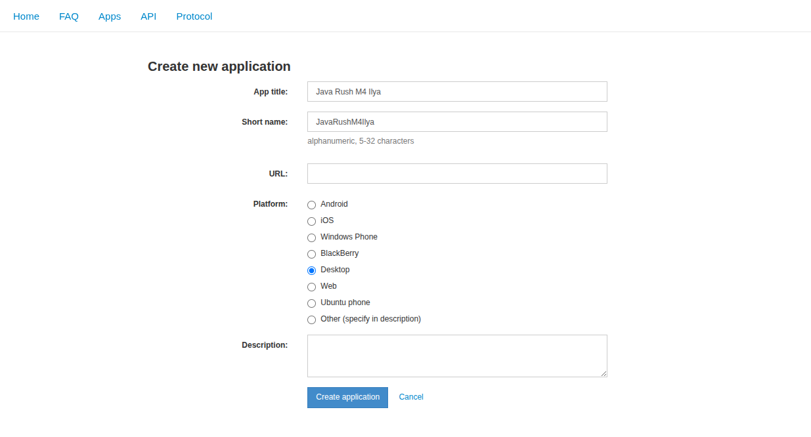

## Регистрация приложения в Telegram 

### 1. Перейдите на сайт:

```
https://my.telegram.org
```

---

### 2. Войдите в аккаунт

1. Введите **номер телефона**, привязанный к Telegram
2. Получите **код подтверждения в Telegram**
3. Введите код на сайте

---

### 3. Откройте раздел API

Выберите:

```
API development tools
```

---

### 4. Заполните форму

Нужно заполнить несколько полей.

| Поле        | Что указать                          |
| ----------- | ------------------------------------ |
| App title   | любое название приложения            |
| Short name  | короткое имя (латиницей)             |
| URL         | любой сайт или `https://example.com` |
| Platform    | Desktop / Other                      |
| Description | краткое описание                     |

#### Пример заполнения:



---

### 5. Получите ключи

После создания приложения появятся:

```
api_id
api_hash
```

Пример:

```
api_id: 123456
api_hash: abcd1234ef567890abcd1234ef567890
```

---

### 6. Сохраните их в `local_settings.py` или `.env`

Пример для Telethon:

```python
API_ID = 123456

API_HASH = "abcd1234ef567890abcd1234ef567890"
```

---

### ⚠️ Важные особенности и отличия API Telegram от API других ресурсов

| Особенность                              | Пояснение                |
| ---------------------------------------- |--------------------------|
| api_id и api_hash можно посмотреть снова | да, в my.telegram.org    |
| удалить приложение                       | ❗ нельзя                 |
| изменить api_hash                        | ❗ нельзя                 |
| сколько приложений                       | ❗ обычно одно на аккаунт |

